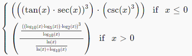

# Лабораторная работа № 2

Вариант: 44446

Студент: Яремко Роман Олегович

Группа: P33113

Преподаватель: Грудина Анна Михайловна

## Задание

```
x <= 0 : (((tan(x) * sec(x)) ^ 3) * (csc(x) ^ 3))
x > 0 : (((((log_10(x) * log_5(x)) * log_2(x)) ^ 3) / log_10(x)) / (ln(x) / (ln(x) + log_10(x))))
```
